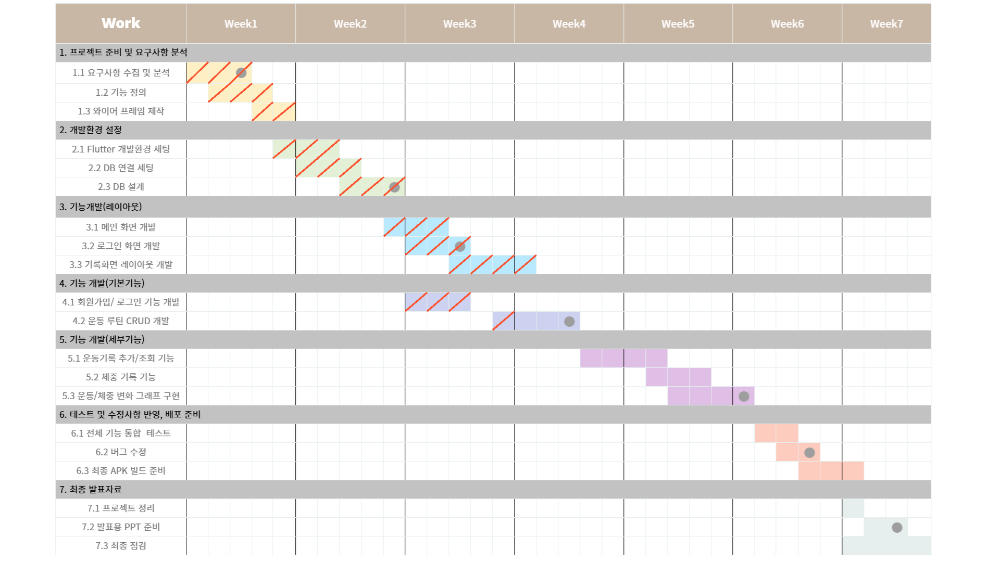

# 💡 프로젝트 계획서

## 📅 2025-04-29

### 📌 프로젝트 주제  
**운동 루틴 & 헬스 기록 앱 - 마음가GYM**

---

### 📝 요구사항 수집 및 분석

#### 👤 사용자 대상
- 운동을 즐겨하는 사람
- 운동을 기록하고 체계적으로 관리하고 싶은 사람

#### 🎯 주요 니즈
- 📋 **개인 운동 루틴 저장 기능**
- 🖊️ **매일 운동 내용을 쉽게 기록 가능**
- 📈 **체중/운동량 변화 추이 시각화 (차트 제공)**
- ⏰ **운동 목표 알람 및 시간 알림 기능**

#### 🔍 벤치마킹
- **플릭**
- **플랜핏**
- **오늘의 운동**

---

### 📊 간트차트


---

# 🧠 Flutter 개발환경 세팅 + Firebase 연동 + Firestore 설계

## 📅 2025-05-12

## 📌 1. Flutter 개발환경 세팅

### ✅ 필수 도구 설치
```bash
# Flutter SDK 설치
https://docs.flutter.dev/get-started/install

# Android Studio 설치 + Flutter, Dart 플러그인 설치
# Android SDK & Emulator 설치 포함
```

### ✅ 새 프로젝트 생성
```bash
flutter create mind_gym
cd mind_gym
```

### ✅ 디바이스 확인
```bash
flutter devices
```

---

## 🔌 2. Firebase 연결 세팅 (Android 기준)

### ✅ Firebase 프로젝트 연결
```text
1. https://console.firebase.google.com 접속
2. 프로젝트 생성 → Android 앱 추가
3. Android 패키지명 입력 (예: com.example.mind_gym)
4. google-services.json 다운로드 → android/app/ 에 넣기
```

### ✅ 프로젝트 레벨 build.gradle.kts 수정
```kotlin
buildscript {
    dependencies {
        classpath("com.google.gms:google-services:4.3.15")
    }
}
```

### ✅ 앱 레벨 build.gradle.kts 수정
```kotlin
plugins {
    id("com.android.application")
    id("org.jetbrains.kotlin.android")
    id("com.google.gms.google-services") // Firebase 플러그인 추가
}

dependencies {
    implementation(platform("com.google.firebase:firebase-bom:32.1.1"))
    implementation("com.google.firebase:firebase-analytics")
    implementation("com.google.firebase:firebase-auth")
    implementation("com.google.firebase:firebase-firestore")
}
```

### ✅ Flutter 초기화
```dart
void main() async {
  WidgetsFlutterBinding.ensureInitialized();
  await Firebase.initializeApp();
  runApp(MyApp());
}
```

---

## 🗂 3. Cloud Firestore DB 설계

### ✅ Firestore 활성화
```text
Firebase 콘솔 → Firestore Database → 시작하기 → 테스트 모드 사용
```

### ✅ 설계 구조 (예: 마음가GYM)
```plaintext
users (컬렉션)
 ┗ userId (문서)
    ┣ routines (컬렉션)
    ┃ ┗ routineId
    ┣ logs (컬렉션)
    ┃ ┗ logId
    ┗ weightRecords (배열 또는 하위 컬렉션)
```


---

## ✅ 기타 유틸 명령어

```bash
flutter pub get           # 의존성 설치
flutter run               # 앱 실행
flutter clean             # 캐시 삭제
flutter doctor            # 환경 진단
```

---

# Flutter 로그인 → 메인화면 전환 + 메인 & 기록화면 레이아웃

## 📅 2025-05-19

## ✅ 1. 로그인 화면 레이아웃

- 이메일 & 비밀번호 입력 필드 구성
- 로그인 버튼 클릭 시 `MainPage`로 전환
- `Navigator.pushReplacement()` 사용해 뒤로가기 차단

```dart
ElevatedButton(
  onPressed: () {
    Navigator.pushReplacement(
      context,
      MaterialPageRoute(builder: (_) => MainPage()),
    );
  },
  child: Text("로그인"),
);
```

---

## ✅ 2. 메인화면 레이아웃

- 앱 상단에는 AppBar(`마음가GYM`)
- 개인 운동 루틴을 카드 형태로 표시
- 각 루틴 카드에는 [운동 추가] / [루틴 수정] 버튼
- 하단에 BottomNavigationBar로 화면 전환 (운동 | 기록 | 설정)
- 통계 차트 자리 placeholder 포함

```dart
Text("내 운동 루틴", style: Theme.of(context).textTheme.titleLarge),
RoutineCard(routineName: "하체 루틴"),
RoutineCard(routineName: "상체 루틴"),
Text("📊 최근 운동 통계"),
Container(height: 150, child: Center(child: Text("차트 자리"))),
```

---

## ✅ 3. 기록화면 레이아웃

- 기본 ListView로 날짜별 운동 기록 출력
- `ListTile` 사용하여 날짜 + 루틴 이름 표시

```dart
ListTile(
  leading: Icon(Icons.calendar_today),
  title: Text("상체 루틴"),
  subtitle: Text("2025-05-19"),
);
```

---

## ✅ 4. 전체 흐름 요약

1. 앱 시작 시 `LoginPage` 노출
2. 로그인 버튼 클릭 → `MainPage`로 이동
3. MainPage 내부는 탭 구조로 운동, 기록, 설정 화면 전환 가능

---

# 🧠 Flutter 회원가입/ 로그인 기능 개발, 운동 루틴 CRUD 개발

## 📅 2025-05-26

## 📌 1. Flutter 회원가입/ 로그인 기능 개발

## 🔧 사용 기술
- Flutter
- Firebase Authentication (Phone Sign-In)
- Cloud Firestore

---

## 📌 목표
사용자가 전화번호로 회원가입하고, 인증번호를 입력하여 인증이 완료되면 Firestore에 사용자 정보를 저장하는 기능을 구현한다.

---

## ✅ 구현 흐름

### 1. 전화번호 입력 받기
- `+82` 앞자리 고정 표시
- 사용자는 `01012345678` 형식으로 입력 (내부에서 앞의 `0` 제거하여 `+821012345678`로 변환)

```dart
final rawPhone = phoneController.text.trim();
final phoneNumber = '+82${rawPhone.startsWith('0') ? rawPhone.substring(1) : rawPhone}';
```

---

### 2. 인증번호 요청

- `verifyPhoneNumber()` 호출
- Firebase가 인증번호를 문자로 발송함
- `codeSent` 콜백에서 `verificationId` 저장

```dart
await FirebaseAuth.instance.verifyPhoneNumber(
  phoneNumber: phoneNumber,
  codeSent: (String verificationId, int? resendToken) {
    setState(() {
      _verificationId = verificationId;
      _startTimer(); // 타이머 시작
    });
  },
);
```

---

### 3. 타이머 UI 표시

- 인증번호 발송 시 60초 타이머 시작
- `suffixText: '$_secondsRemaining초'` 형식으로 인증창 우측에 표시

---

### 4. 인증번호 확인

- 입력받은 인증번호(`smsCode`)와 저장된 `verificationId`를 사용해 인증 처리

```dart
final credential = PhoneAuthProvider.credential(
  verificationId: _verificationId!,
  smsCode: smsCodeController.text.trim(),
);

await FirebaseAuth.instance.signInWithCredential(credential);
```

---

### 5. Firestore에 사용자 정보 저장

```dart
await FirebaseFirestore.instance.collection('users').doc(user.uid).set({
  'phone': phoneNumber,
  'nickname': nicknameController.text.trim(),
  'isApproved': false,
  'createdAt': FieldValue.serverTimestamp(),
  'role': 'user',
});
```

---

## 🔁 추가 기능

- 1분 타이머 만료 시 `"인증번호 재요청"` 버튼 활성화
- 재요청 시 `verifyPhoneNumber()` 재실행
- 인증 실패 시 에러 메시지 출력

---

## 🧠 주의사항

| 항목 | 설명 |
|------|------|
| SHA-1 키 등록 | Firebase 콘솔에 디버그 SHA-1 등록 필요 |
| 앱 서명 문제 | `BILLING_NOT_ENABLED`, `reCAPTCHA` 관련 에러 해결 필요 |
| Firebase 프로젝트 Billing | 전화 인증 시 GCP 결제 계정 연결 필요 |
| 테스트 시 실제 기기 | 에뮬레이터는 SMS 수신 불가 |

---

## 📝 참고

- Firebase Auth Phone 인증: [공식 문서](https://firebase.google.com/docs/auth/flutter/phone-auth)
- SHA-1 키 확인: `gradlew signingReport`

### 📊 간트차트



---


