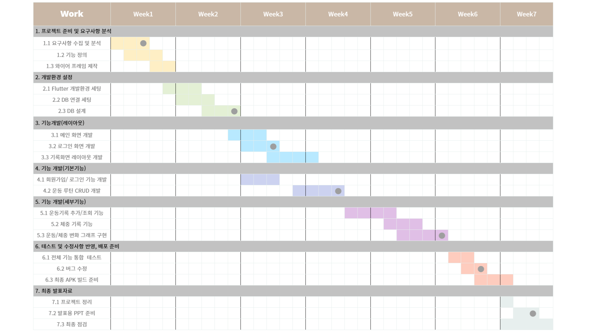

# 💡 프로젝트 계획서

## 📅 2025-04-29

### 📌 프로젝트 주제  
**운동 루틴 & 헬스 기록 앱 - 마음가GYM**

---

### 📝 요구사항 수집 및 분석

#### 👤 사용자 대상
- 운동을 즐겨하는 사람
- 운동을 기록하고 체계적으로 관리하고 싶은 사람

#### 🎯 주요 니즈
- 📋 **개인 운동 루틴 저장 기능**
- 🖊️ **매일 운동 내용을 쉽게 기록 가능**
- 📈 **체중/운동량 변화 추이 시각화 (차트 제공)**
- ⏰ **운동 목표 알람 및 시간 알림 기능**

#### 🔍 벤치마킹
- **플릭**
- **플랜핏**
- **오늘의 운동**

---

### 📊 간트차트

---

